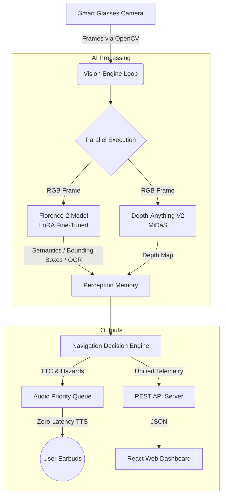
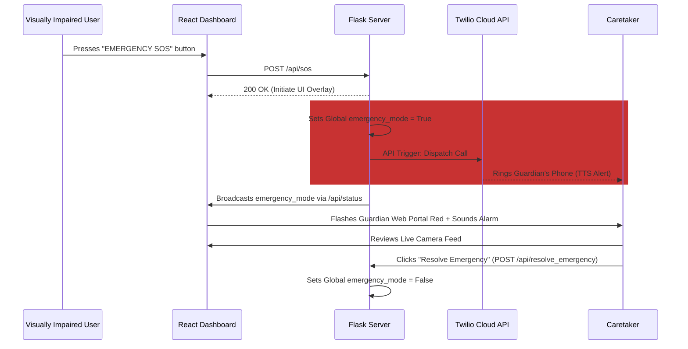

# NAVI: AI Smart Glasses Server

## Overview

NAVI is a computer vision server designed to provide spatial awareness, obstacle avoidance, and scene understanding for visually impaired users via smart glasses. The system processes a live video feed, extracting geometric and semantic information to issue priority-queued audio navigation commands.

## Technical Strategy

The technical strategy of NAVI revolves around a **Modular, Dual-Model Edge Architecture** designed for high reliability and low latency:
1. **Parallel AI Processing**: Offloading scene context (Florence-2) and depth mapping (Depth Anything V2) to discrete, asynchronous pipelines to prevent blocking the main camera feed.
2. **Parameter-Efficient Fine-Tuning (PEFT)**: Utilizing LoRA to heavily optimize Florence-2 Large on a hybrid dataset (VOC2012 + custom navigation annotations) to excel at pedestrian hazard recognition without requiring a massive multi-GPU cluster.
3. **Decoupled Frontend**: Isolating the UI (React/Vite) from the AI backend (Flask/PyTorch) via REST APIs. This ensures that UI polling never interrupts critical safety loops.
4. **Offline-First Audio**: Using `pyttsx3` for immediate, zero-latency text-to-speech feedback, avoiding cloud latency for critical navigation directions.

## Implementation Process & Architecture

### System Data Flow


### Guardian Emergency Protocol Flow


## Modular Vision Foundation Architecture

NAVI has recently been completely refactored to support a **Modular Vision Foundation Architecture**. The perception system is abstracted behind two core interfaces: `VisionModel` and `DepthModel`, allowing any future AI models to be swapped in seamlessly without touching business logic.

Currently, the architecture implements a strict separation of concerns:
- **Vision Foundation Model**: Florence-2 (Scene Context & OCR via `FlorenceProvider`)
- **Depth Estimation Model**: MiDaS (Spatial Mapping via `MiDaSProvider`)
- **Decision Engine**: Navigation Engine
- **Voice Guidance**: Audio Engine

The frame processing flow executes in the following sequence:

1. **Camera Input**: High-speed frame acquisition via OpenCV.
2. **Vision & Depth Models**: Extracts rich scene semantic data, OCR, and a normalized depth map using the standardized provider interfaces.
3. **Temporal Memory & Tracking**: A software-based Temporal Memory layer persists detections and scene state across frames to stabilize the unified `PerceptionResult`.
4. **Navigation Decision**: The Navigation Engine consumes the standardized `PerceptionResult` (scene, OCR, depth, tracked objects) and calculates depth/distance dynamically.
5. **Threat Detection**: The engine calculates Time-To-Collision (TTC) using depth velocity and flags immediate hazards.
6. **Speech Priority Queue**: Audio messages are dispatched into an asynchronous priority queue.
7. **Unified Data**: All downstream consumers (Dashboard, Navigation) operate strictly on the `PerceptionResult` object, making the entire pipeline model-agnostic.

## Technology Stack

### Core System
- **Language**: Python 3.11+
- **Hardware Acceleration**: PyTorch (CUDA supported)
- **Web Interface**: Flask, HTML5, Vanilla JavaScript, CSS

### AI & Machine Learning Models
- **Microsoft Florence-2 Large**: Vision-language model for rich, high-level scene understanding and OCR.
- **MiDaS (intel-isl/MiDaS)**: Monocular depth estimation for spatial mapping.

### Audio & I/O
- **pyttsx3**: Cross-platform Text-to-Speech synthesis with priority threading.
- **OpenCV**: Video capture, frame preprocessing, and stream encoding.

## Project Structure

- `main.py`: The entry point. Initializes the Flask server and APIs.
- `config.py`: Centralized configuration (thresholds, memory parameters).
- `src/vision/interfaces.py`: Abstraction layer defining `VisionModel`, `DepthModel`, and `PerceptionResult`.
- `src/vision/florence_provider.py`: Implementation of the `VisionModel` using Florence-2.
- `src/vision/midas_provider.py`: Implementation of the `DepthModel` using MiDaS.
- `src/perception/memory.py`: Software logic for Temporal Memory and bounding box stabilization.
- `src/navi_engine.py`: Orchestrates the primary AI loops and integrates the modular vision pipeline.
- `src/navigation_engine.py`: Houses the logic for spatial calculations and collision prediction.
- `src/audio_engine.py`: Thread-safe priority queue for TTS operations.

## Installation and Execution

### Prerequisites
- Python 3.11 or higher.
- NVIDIA GPU with CUDA Toolkit (highly recommended).

### Execution

**Manual Execution**:
```bash
python main.py
```
The server will load all PyTorch models into VRAM and expose the web dashboard on `http://127.0.0.1:5000` (or `http://localhost:5173` via Vite).

## Guardian Emergency System & Twilio

NAVI includes a built-in **Guardian Emergency System** that allows a visually impaired user to trigger an SOS.
By default, the system runs an **Automated Call Simulator** which plays an alarm locally and flashes the caretaker's remote dashboard (`/guardian`) to save costs during testing.

To enable real-world phone calls to a configured caretaker:
1. Create a free account at [Twilio.com](https://www.twilio.com).
2. Obtain your **Account SID**, **Auth Token**, and a Twilio **Phone Number**.
3. Install the Twilio Python SDK: `pip install twilio`
4. In `main.py`, locate the `_simulate_automated_call()` function and replace the mock `print()` logic with the official Twilio API snippet:
   ```python
   from twilio.rest import Client
   client = Client("YOUR_ACCOUNT_SID", "YOUR_AUTH_TOKEN")
   call = client.calls.create(
       twiml='<Response><Say>Automated Alert. The NAVI user has triggered an SOS. Please check the Guardian Panel.</Say></Response>',
       to=guardian_info.get("phone"),
       from_="YOUR_TWILIO_PHONE_NUMBER"
   )
   ```
Once you add these keys, any time the user hits the SOS button in the UI, a real automated voice call will be dispatched to the Guardian's phone number!

## Shared AI State API

The system exposes telemetry via `/api/status`. The payload includes:
- **Scene Status & OCR**: Short, rich contextual descriptions.
- **Navigation State**: Bounding boxes, distances, safe direction vectors, collision risk.
- **Diagnostics**: System health, frame rates, and latency.
